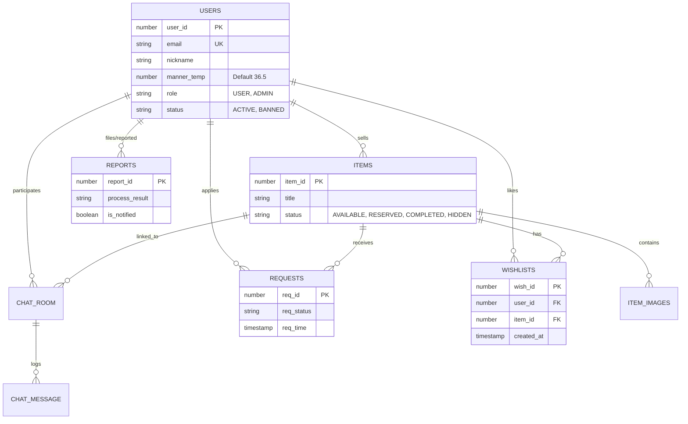

# 🎁 WEGIVE (위기브)

> **“따뜻한 나눔의 시작, 우리 동네에서부터”** > **WEGIVE**는 실제 거주지 인증을 기반으로 이웃 간 물품을 무료로 나누고,  
> **실시간 채팅**과 **통합 알림**을 통해 안전하고 끊김 없는 나눔 경험을 제공하는 **위치 기반 물품 공유 플랫폼**입니다.

---

## 📌 Project Overview

* **프로젝트 유형**: 포트폴리오 / 실무형 개인 프로젝트
* **개발 목적**
    * 위치 인증 기반(Geolocation + Kakao API) 커뮤니티 설계
    * Spring Boot & WebSocket을 활용한 **실시간 서비스** 구현
    * JPA의 연관관계 매핑 및 데이터 무결성(Cascade) 관리 경험
* **핵심 키워드**: `Location-based`, `Real-time`, `Clean Architecture`, `Data Integrity`, `Spring Boot 4.0`

---

## 🛠 Tech Stack

### 💻 Environment
* **Language**: Java JDK 25
* **Framework**: Spring Boot 4.0.1
* **Build Tool**: Gradle
* **IDE**: IntelliJ IDEA

### 🧱 Backend
* **Database**: Oracle Database 11g XE
* **ORM**: Spring Data JPA (Hibernate)
* **Security**: Spring Security 6 (OAuth2, Role-based Auth)
* **Real-time**: Spring WebSocket (STOMP Message Broker)
* **Authentication**: OAuth2 (Kakao, Naver, Google) + JWT/Session Hybrid
* **HTTP Client**: RestTemplate (External API Communication)
* **Validation**: Bean Validation

### 🎨 Frontend & UX
* **Template Engine**: Thymeleaf (SSR)
* **Framework**: Bootstrap 5.3
* **Scripting**: Vanilla JS (ES6+), Fetch API / AJAX
* **Real-time Client**: SockJS, Stomp.js
* **UI Library**: SweetAlert2 (Custom Alerts), Bootstrap Icons
* **External APIs**: Kakao Maps API, Daum Postcode API

---

## 🚀 Key Features & Technical Implementation

### 1. 관심 상품 및 찜하기 (`Wish Domain`)
`WishlistController`, `WishlistService`, `WishlistRepository`를 통해 사용자의 관심사를 관리하고 인기 지표를 제공합니다.
* **Toggle Mechanism**: `toggleWishlist` 메서드에서 DB 조회를 통해 이미 찜한 상태면 **삭제(취소)**하고, 없으면 **저장(찜하기)**하는 토글 로직을 구현했습니다.
* **Duplicate Prevention**: DB 레벨에서 `UniqueConstraint(USER_ID, ITEM_ID)`를 걸어 동일 상품에 대한 중복 찜 등록을 원천 차단했습니다.
* **Real-time Count**: `Item` 엔티티의 `@Formula`를 통해 조회 시점의 찜 개수를 서브쿼리로 가져오거나, 서비스 레이어에서 `countByItem`을 호출하여 실시간 인기를 반영합니다.
* **Candidate Filtering**: 나눔이(판매자)는 자신의 물건을 찜한 사용자 목록(`findByItem`)을 조회하여 잠재적인 나눔 대상자를 파악할 수 있습니다.

### 2. 회원 관리 및 마이페이지 (`User Domain`)
* **Data Aggregation**: `MyPageResponseDto`를 통해 나눔 활동, 받은 내역, 찜 목록을 한 번에 조회합니다.
* **Manner Temperature**: 나눔 완료 후 감사 인사를 받으면 매너 온도가 상승(+0.5)합니다.
* **Location Verification**: Kakao Local API를 통해 위도/경도를 행정동 주소로 변환하여 동네 인증을 수행합니다.
* **Cascading Delete**: 회원 탈퇴 시 `deleteByUser`를 호출하여 찜 목록을 포함한 모든 연관 데이터를 일괄 삭제합니다.

### 3. 나눔 신청 및 당첨자 선정 (`Request Domain`)
* **Fair Process**: 자전거래(Self-Dealing) 방지 로직과 `UniqueConstraint`를 통한 중복 신청 방지, 그리고 **0.001초 단위의 선착순 정렬**(`OrderByReqTimeAsc`)을 지원합니다.

### 4. 신고 및 처리 결과 알림 (`Report Domain`)
* **Feedback Loop**: 신고 접수 → 관리자 검토(승인/반려) → 결과 알림(`isNotified` 플래그)으로 이어지는 순환 구조를 완성했습니다. 알림 확인 시 즉시 읽음 처리됩니다.

### 5. 소셜 로그인 및 회원가입 (`Login Domain`)
* **OAuth2 Integration**: 카카오/네이버/구글 인증 및 예외 상황(이메일 누락 등)에 대한 방어 로직을 적용했습니다.
* **Auto Registration**: 신규 유저는 인증 즉시 별도 절차 없이 자동 회원가입 처리됩니다.

### 6. 물품 관리 및 최적화 (`Item Domain`)
* **Optimization**: `Fetch Join`으로 N+1 문제 해결, `@BatchSize`로 이미지 조회 최적화, `Slice` 기반 무한 스크롤을 구현했습니다.

### 7. 실시간 채팅 (`Chat Domain`)
* **Hybrid Architecture**: 메시지 전송 시 DB 영구 저장과 동시에 WebSocket(`SimpMessagingTemplate`)으로 브로드캐스팅합니다.
* **Status Sync**: 거래 상태 변경 시 시스템 메시지를 전송하고, 상대방에게 실시간 알림(Red Dot)을 트리거합니다.

---

## 💡 Future Improvements (Reflections)

프로젝트를 진행하며 아쉬웠던 점과 향후 보완 계획입니다.

* **반경 기반 물품 필터링 (Distance Filter)**
    * **현황**: 마이페이지 내 **Kakao Local API를 활용한 위치 인증(위도/경도 저장 및 행정동 변환)** 기능은 성공적으로 구현하여 사용자의 실제 거주지를 확보했습니다.
    * **보완점**: 메인 피드에서 **"내 위치 기준 반경 1km/2km 이내"**의 물품만 필터링하여 보여주는 기능은 구현하지 못했습니다.
    * **계획**: 추후 Oracle Spatial 기능 또는 Haversine 공식을 QueryDSL/JPQL에 적용하여, 단순 최신순 정렬이 아닌 **사용자 거리 기반의 정교한 필터링 로직**을 도입할 예정입니다.

---

## 📡 API Specification

### ❤️ Wishlist (`WishlistController`)
| Method | Endpoint | Description | Note |
| :--- | :--- | :--- | :--- |
| **POST** | `/api/wishes/item/{itemId}` | 찜하기 토글 | 찜 등록/취소 스위칭 |
| **GET** | `/api/wishes/me` | 내 찜 목록 | 최신순 정렬 |

### 👤 User (`UserController`)
| Method | Endpoint | Description | Note |
| :--- | :--- | :--- | :--- |
| **GET** | `/api/users/me` | 마이페이지 정보 | 활동 내역 통합 조회 |
| **POST** | `/api/users/withdraw` | 회원 탈퇴 | 연관 데이터 삭제 |
| **POST** | `/api/users/me/location` | 동네 인증 | GPS 기반 주소 변환 |

### 🙋‍♀️ Request (`RequestController`)
| Method | Endpoint | Description | Note |
| :--- | :--- | :--- | :--- |
| **POST** | `/api/requests` | 나눔 신청 | 중복/본인 신청 방지 |
| **GET** | `/api/requests/item/{id}` | 신청자 목록 | 판매자 전용 (시간순) |

### 🚨 Report (`ReportController`)
| Method | Endpoint | Description | Note |
| :--- | :--- | :--- | :--- |
| **POST** | `/api/reports` | 신고 접수 | 비매너/사기 등 사유 |
| **GET** | `/api/reports/notifications` | 결과 알림 | 로그인 시 호출 |

### 🔐 Authentication (`AuthController`)
| Method | Endpoint | Description | Note |
| :--- | :--- | :--- | :--- |
| **POST** | `/api/auth/login` | 소셜 로그인 | 3사 통합 처리 |
| **POST** | `/api/auth/logout` | 로그아웃 | Refresh Token 삭제 |

### 📦 Item (`ItemController`)
| Method | Endpoint | Description | Note |
| :--- | :--- | :--- | :--- |
| **POST** | `/api/items` | 물품 등록 | 이미지 최대 5장 |
| **GET** | `/api/items` | 전체 조회 | Slice 페이징 |

### 💬 Chat (`ChatController`)
| Method | Endpoint | Description | Note |
| :--- | :--- | :--- | :--- |
| **POST** | `/chat/room` | 채팅방 생성 | 알림 전송 |
| **WS** | `/pub/chat/message` | 메시지 전송 | WebSocket |

---

## 🗄️ Database Design

### ERD & Relationships

| Table | Description | Relationships |
|------|------------|---------------|
| **USERS** | 회원 정보 | ITEMS(1:N), REQUESTS(1:N), CHAT(1:N), WISH(1:N) |
| **ITEMS** | 나눔 물품 | IMAGES(1:N), REQUESTS(1:N), WISH(1:N) |
| **REQUESTS** | 나눔 신청 | ITEMS(N:1), USERS(N:1) |
| **WISHLISTS** | 찜하기 | ITEMS(N:1), USERS(N:1) |
| **CHAT** | 채팅 및 메시지 | ITEMS(N:1), USERS(N:1) |
| **REPORTS** | 신고 내역 | USERS, ITEMS |



---

## 📂 Project Structure
MVC 패턴과 도메인 주도 설계(DDD)를 혼합하여 유지보수성을 높였습니다.
```Plaintext
src/main
├── java/com/wegive
│   ├── domain
│   │   ├── admin           # 관리자 (대시보드, 회원/물품 관리)
│   │   ├── auth            # 인증 (로그인, 토큰)
│   │   ├── chat            # 채팅 (WebSocket, Room/Message)
│   │   ├── home            # 메인 홈 (검색, 배너)
│   │   ├── item            # 물품 (CRUD, 이미지, 검색)
│   │   ├── login           # 소셜 로그인 (Google, Kakao, Naver)
│   │   ├── report          # 신고 (접수, 결과 알림)
│   │   ├── request         # 신청 (나눔 신청, 신청자 목록)
│   │   ├── user            # 회원 (마이페이지, 프로필)
│   │   └── wish            # 찜하기 (관심상품 등록/취소)
│   └── global              # 전역 설정 (Config, DTO, Exception)
└── resources
    ├── application.yaml    # 설정 파일
    ├── schema.sql          # DB 초기화 스크립트
    ├── static              # 정적 리소스
    └── templates           # Thymeleaf Views
```

---

## ⚙️ Getting Started

### 1. Configuration (application.yaml)
로컬 환경에 맞게 application.yaml 파일을 설정해야 합니다.
```YAML
# Database (Oracle XE)
spring:
  datasource:
    url: jdbc:oracle:thin:@localhost:1521:XE
    username: ${YOUR_USERNAME}
    password: ${YOUR_PASSWORD}

# OAuth2 Keys
oauth:
  naver:
    client-id: ${YOUR_NAVER_CLIENT_ID}
    client-secret: ${YOUR_NAVER_CLIENT_SECRET}
  google:
    client-id: ${YOUR_GOOGLE_CLIENT_ID}
    client-secret: ${YOUR_GOOGLE_CLIENT_SECRET}
```

### 2. Frontend API Keys
HTML 파일 내 지도 API Key 교체가 필요합니다.

- Target Files: item-form.html, item-edit.html, header.html
- Kakao Maps SDK:
  ```HTML
  <script src="//dapi.kakao.com/...appkey=YOUR_KEY..."></script>
  ```

### 3. Database Initialization
최초 실행 시 `schema.sql` 을 실행하여 테이블을 생성합니다.

### 4. Run Application
```Bash
./gradlew bootRun
```

### 5. Admin Access
관리자 권한 부여 SQL:
```SQL
UPDATE USERS SET ROLE = 'ADMIN' WHERE EMAIL = 'admin@wegive.com';
COMMIT;
```

---

## 📜 License

This project is licensed under the **MIT License** - see the [LICENSE](LICENSE) file for details.

---

## 📮 Contact & Support

프로젝트에 대한 피드백이나 문의사항은 아래 채널을 통해 연락주세요.

* **Developer**: [SUNGHO CHOI]
* **Email**: `csh6170@gmail.com`
* **GitHub**: [https://github.com/csh6170/wegive](https://github.com/csh6170/wegive)

<br>

> **WEGIVE**는 우리 동네의 따뜻한 연결을 지향합니다. 🌿
>
> *Small Sharing, Big Warmth.*

**© 2026 WEGIVE Project. All Rights Reserved.**
<br>
`Copyright (c) 2026 SUNGHO CHOI`
